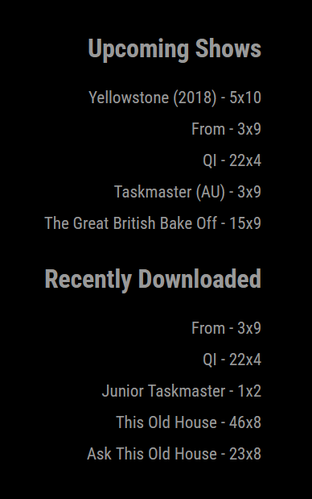

# MMM-Sonarr

MMM-Sonarr is a MagicMirror² module that displays upcoming shows and recently downloaded episodes from your Sonarr instance.

## Features

- Shows upcoming episodes from your Sonarr calendar
- Displays recently downloaded episodes
- Displays missed downloads in the last 5 days
- Configurable update interval and display limits

## Screenshot



## Installation

1. Navigate to your MagicMirror's `modules` directory:
    ```bash
    cd ~/MagicMirror/modules
    ```

2. Clone this repository:
    ```bash
    git clone https://github.com/gravitykillseverything/MMM-Sonarr.git
    ```


## Configuration

Add the following configuration to your `config/config.js` file:

```javascript
{
    module: "MMM-Sonarr",
    position: "top_right",
    config: {
        apiKey: "YOUR_SONARR_API_KEY",
        baseUrl: "http://localhost:8989",
        upcomingLimit: 5,
        historyLimit: 5,
        updateInterval: 1 * 60 * 1000, // 1 minute
    }
},
```

### Configuration Options

| Option | Description |
|--------|-------------|
| `apiKey` | Your Sonarr API key |
| `baseUrl` | The base URL of your Sonarr instance |
| `upcomingLimit` | Number of upcoming shows to display |
| `historyLimit` | Number of recently downloaded episodes to display |
| `updateInterval` | How often to update the data (in milliseconds) |


## Contributing

Contributions are welcome! Please feel free to submit a Pull Request.

## License

This project is licensed under the MIT License.

